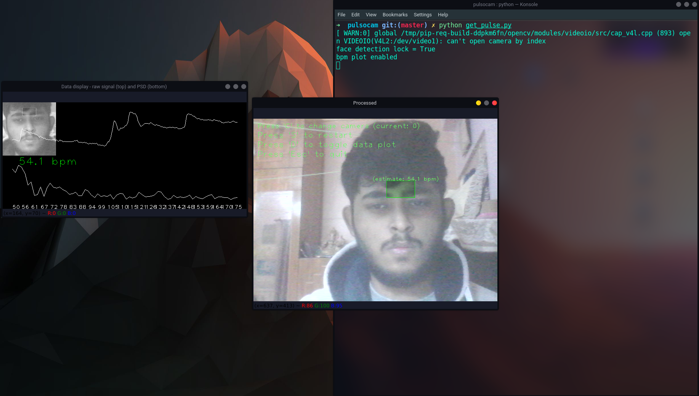
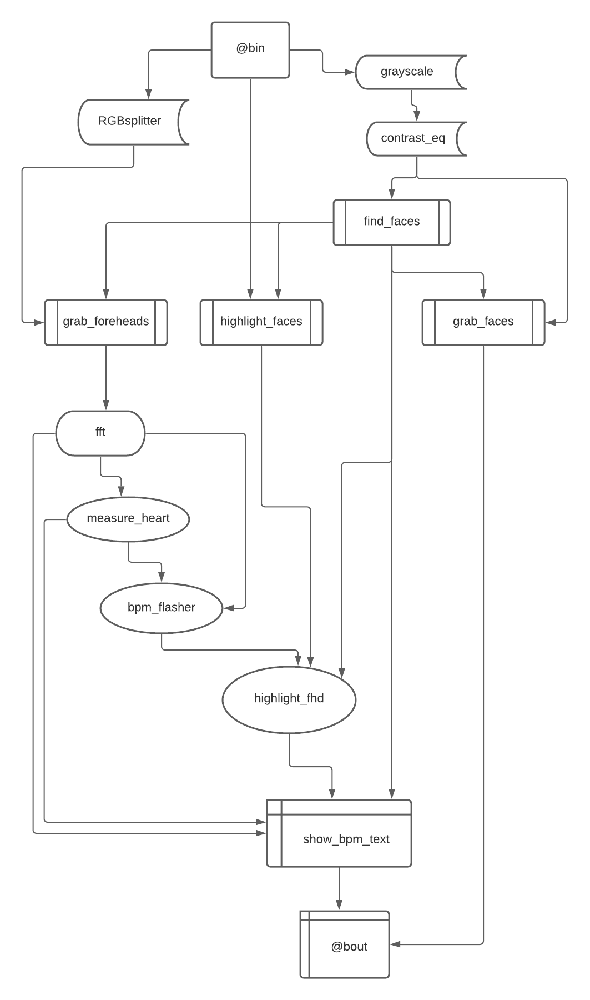

# Pulsocam
## OpenCV project to detect your pulse rate using webcam. Inspired by MIT AI team.

 

# Working:

It uses OpenCV to detect the location of the person's face and isolates the forehead region. Data is continuously collected over time to estimate the user's hear rate. This is done by measuring average optical intensity in the forehead location, in the subimage's green channel alone (a better color mixing ratio may exist, but the blue channel tends to be very noisy).

Human vital signs like heart rate, blood oxygen saturation and related physiological measures can be measured using a technique called photo-plethysmography (PPG). This technique involves optically
monitoring light absorption in tissues that are associated with blood volume changes.
However, the ability to obtain such measurements remotely via a camera/webcam, albeit less accurately, can enable applications outside the medical
domain (e.g., affective computing, human–computer interaction), where contact sensors are not feasible.
Remote photo-plethysmography (rPPG) detects the blood volume pulse remotely by tracking changes in the skin reflectance as observed by a camera.  

Once the user's heart rate has been estimated, real-time phase variation associated with this frequency is also computed. This allows for the heartbeat to be exaggerated in the post-process frame rendering, causing the highlighted forehead location to pulse in sync with the user's own heartbeat.

# How to run:
## <code> python get_pulse.py </code>

